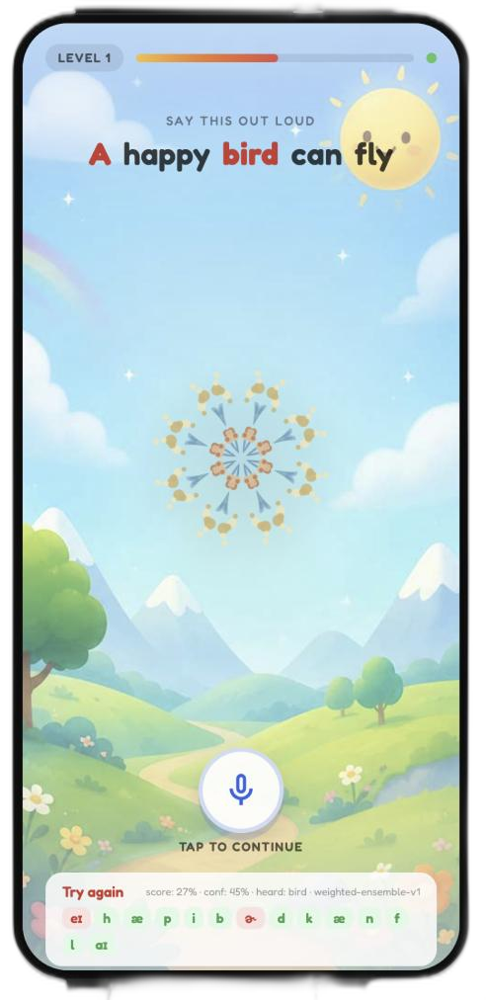
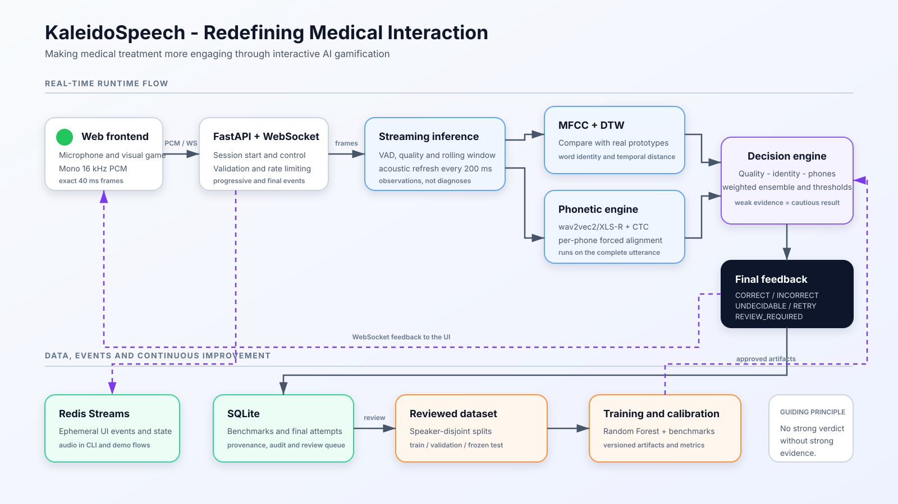

# KALEIDOSPEACH

Quick demo guide: [docs/HACKATHON_DEMO.md](docs/HACKATHON_DEMO.md).

A complete demo prototype for a pronunciation-training application.
This project aims to make repetitive speech-therapy exercises engaging through
a gamified approach:

- a responsive UI that provides real-time feedback;
- a set of independent decision stages that determine in real time whether the
  pronunciation is correct.


## TRY IT NOW

Download all pipeline with: "./start_demo.sh"

Initialize the environment, database, and benchmarks:

```bash
make init
make redis
make build-demo
```

Before starting the application, complete the required
[phonetic model setup](#phonetic-model-required).

For subsequent runs, the following commands are enough:

```bash
make redis
make dev
```

Open <http://localhost:8765> and press the microphone button:

1. The first press grants permission and starts recording.
2. Read the full sentence.
3. The second press stops recording and requests evaluation.

The browser opens two WebSocket connections with the same session ID:

- one sends mono 16 kHz PCM in 40 ms frames;
- the other receives progress events and the final result.

Each sentence is evaluated as a whole. The backend sends progressive updates
for each target word while the user reads, followed by the final result.

This demo runs locally. Production deployments must use HTTPS.

## User interface



The interface turns each pronunciation exercise into a visual progression. It
highlights the current target word, captures the complete sentence through the
microphone, displays phoneme-level feedback, and updates the central
kaleidoscope according to the result.

The UI handles four decision outcomes:

- `CORRECT`: the exercise is accepted and the visual reward grows;
- `INCORRECT`: the learner receives targeted pronunciation feedback;
- `UNDECIDABLE`: the available evidence is not strong enough for a reliable
  decision;
- `RETRY`: the recording quality is insufficient and the learner is asked to
  try again.

## STATUS

The project is currently a proof of concept with an integrated static frontend,
browser microphone streaming, a database, caching, audio cleaning, and a
decision pipeline. **It is not clinically validated.**

Implemented:

- microphone capture as mono 16 kHz signed 16-bit little-endian PCM;
- 40 ms audio frames published to Redis Streams;
- validation and aggregation of contiguous frames into complete word windows;
- deterministic audio-cleaning pipeline;
- SQLite schema and repositories for benchmarks and pronunciation attempts;
- Redis-backed session state, benchmark cache, and UI event streams;
- FastAPI health endpoint and WebSocket event forwarding;
- safe ZIP ingestion for isolated English word datasets;
- deterministic speaker-disjoint train/validation/test assignment;
- versioned MFCC summary features persisted in SQLite;
- temporal MFCC trajectories with delta and delta-delta coefficients;
- speaker/channel normalization and DTW against real recording medoids;
- contrastive comparison against every active word benchmark;
- robust per-word acoustic prototypes and calibrated decision thresholds;
- explicit `CORRECT`, `INCORRECT`, `UNDECIDABLE`, and `RETRY` outcomes;
- deterministic English prompt composition for the current vocabulary;
- rolling 40 ms streaming observations with background DTW refreshes;
- utterance-final wav2vec2/XLS-R phoneme inference adapter;
- internal CTC Viterbi forced alignment with per-phone spans and scores;
- conservative quality → identity → alignment → phone decision cascade;
- sentence-benchmark streaming with live phrase scoring and per-word updates;
- a runnable local worker path for WAV evaluation;
- static gamified frontend with mock and real-backend modes;
- browser microphone capture, resampling and exact 40 ms PCM streaming;
- authenticated review queue, decision audit trail and Prometheus metrics;
- Docker/Compose/Kubernetes deployment artifacts and health probes;
- unit, integration, black-box, and cleaning-performance tests.

Still to be integrated or validated:

- production-grade adaptive VAD and word-boundary segmentation;
- learner-speech calibration and speaker-disjoint phonetic validation;
- annotated learner-speech validation and clinical review;
- production identity provider and jurisdiction-specific retention controls;
- supported-browser microphone QA and production soak testing.

The phonetic path uses
`facebook/wav2vec2-xlsr-53-espeak-cv-ft` behind `PhonemeModel`, followed by an
internal CTC Viterbi aligner. It runs on a complete isolated word or known
sentence utterance. Its thresholds are explicitly marked uncalibrated until
labelled learner speech is available, so missing or weak evidence yields
`UNDECIDABLE`.

## Architecture

Audio is captured by the browser and sent to the backend as 40 ms PCM frames.
The pipeline cleans the signal, checks recording quality and word identity,
aligns the expected phonemes, and produces progressive per-word updates. Redis
manages temporary streaming state, while SQLite stores benchmarks, decision
provenance, and final pronunciation attempts.



Redis contains ephemeral audio, session state, and UI events. SQLite contains
durable benchmark definitions, feature provenance, calibrated thresholds, and
final pronunciation attempts. Streaming distance events are observations
rather than clinical or educational diagnoses.

## Requirements

- [uv](https://docs.astral.sh/uv/getting-started/installation/)
- Docker
- PortAudio on Linux
- the phonetic model and its Python dependencies

Python does not need to be installed manually: `uv sync` downloads the required
Python version, creates `.venv`, and installs the dependencies declared in
`pyproject.toml` at the versions resolved in `uv.lock`.

### CachyOS / Arch Linux

```bash
sudo pacman -S uv portaudio docker
sudo systemctl enable --now docker
```

### macOS

Install [Docker Desktop](https://docs.docker.com/desktop/setup/install/mac-install/)
and uv:

```bash
brew install uv
```

The `sounddevice` package installed by `uv sync` includes PortAudio on macOS.

## Setup

From the repository root:

```bash
uv sync
cp .env.example .env
```

### Phonetic model (required)

The phonetic model is required by the decision system. Without it, the
application cannot complete full pronunciation evaluation.

Install the phonetic dependencies and download the pinned model into the local
deployment cache:

```bash
uv sync --extra phonetic
uv run python -m scripts.cache_phoneme_model \
  --cache-dir data/model-cache
```

Set the following value in `.env`:

```dotenv
PHONETIC_ENABLED=true
```

Start the application in offline mode so that requests never trigger model
downloads at runtime:

```bash
HF_HUB_OFFLINE=1 TRANSFORMERS_OFFLINE=1 make dev
```

Start Redis:

```bash
docker run --name advx-redis \
  -p 127.0.0.1:6379:6379 \
  -d redis:8.8.0-alpine \
  redis-server --appendonly yes
```

After the first run, restart the existing container with:

```bash
docker start advx-redis
```

Verify that Redis 8 exposes both transport and vector-search capabilities:

```bash
uv run python -m scripts.check_redis
```

Populate the optional HNSW index from accepted SQLite MFCC summaries:

```bash
SQLITE_PATH=/tmp/advx-demo.sqlite3 \
  uv run python -m scripts.sync_vector_index \
  --query-recording-id 1 -k 5
```

The synchronization is idempotent. It computes one global normalization for
the selected locale, upserts keys by immutable recording ID, and stores the
normalization version alongside the index.

Redis is optional for local WAV evaluation. SQLite remains authoritative; Redis
8 provides streams, cache, Search/HNSW retrieval, and the native Vector Set
commands. A core-only Redis or Valkey package can run streams but cannot enable the
optional `FT.SEARCH` index.

## Tests

Run the complete suite:

```bash
uv run pytest
```

The suite covers API health, audio framing, Redis adapter behavior, SQLite
transactions and input handling, cleaning quality and performance, contiguous
word-window aggregation, pronunciation-engine invocation, and final attempt
persistence. Most tests use isolated databases and Redis doubles; tests that
need a live Redis instance are skipped when it is unavailable.

## Microphone streaming demo (40 ms)

The prototype presents a sentence, records mono 16 kHz PCM in exact 40 ms
frames, and prints one JSON event per frame. VAD and quality estimates are
updated for every frame; the DTW comparison is refreshed every 200 ms over a
rolling window.

To receive only a provisional response every 40 ms for a single word, use
focused mode:

```bash
uv run python -m scripts.streaming_demo bird --decision-only
```

## License

Copyright 2026 Manuel Magnabosco.

Licensed under the [Apache License 2.0](LICENSE).

## Authors

- Manuel Magnabosco
- Emma Borghi
- Luis Liebenstein
